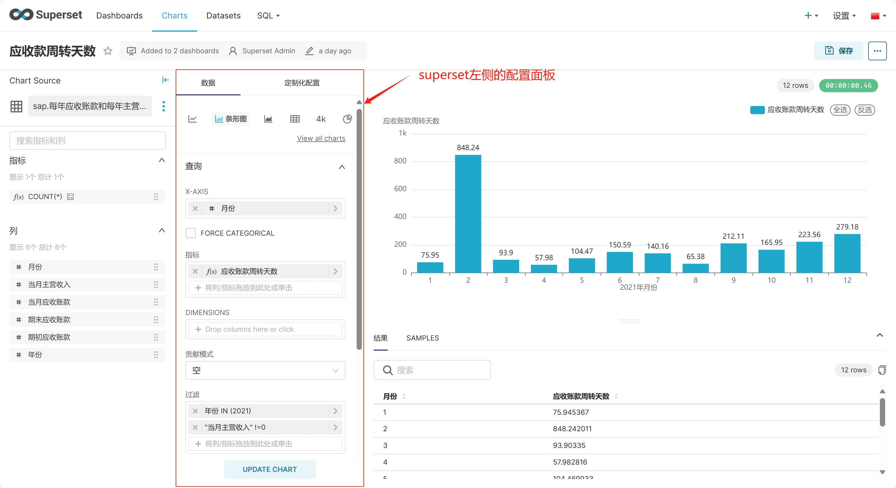

# Windows 环境搭建

## 前言

不建议在windows环境下开发superset，你会遇到许多奇奇怪怪的问题。建议[在Linux环境下开发](linux-huan-jing-da-jian.md)，在你的Windows系统中，你可以使用WSL环境或者虚拟机，然后vscode远程开发。如果你还是想尝试一下，就是想要在windows环境上运行源码（像我一样），可以接着往下看。

## 克隆仓库

在 GitHub 上分叉存储库，然后克隆它。可以直接克隆主存储库，但无法发送拉取请求。

在windows克隆superset之前运行：

```
#提交时转换为LF，检出时不转换
git config --global core.autocrlf input
```

上面代码的作用是禁止git拉取代码时的换行符转换，防止将LF转换成CRLF（不用问我为什么，不这样做Eslint会报错）

```
git clone https://github.com/apache/superset.git
cd superset
```


## 后端

环境依赖：python3.9、python3.10或python3.11

```bash
# 创建一个虚拟环境并激活
python3 -m venv venv 
source venv/bin/activate

# 安装外部依赖(这一步会报错，往下看)
pip install -r requirements/development.txt

# 以可编辑（开发）模式安装 Superset
pip install -e .

# 初始化数据库
superset db upgrade

# 创建管理员用户
superset fab create-admin

# 创建默认角色和权限
superset init

# 加载案例数据 ，在此之前必须创建管理员用户
superset load-examples

# 从虚拟环境内部启动 Flask 开发 Web 服务器。
superset run -p 8088 --with-threads --reload --debugger --debug
```


在`pip install -r requirements/development.txt`安装依赖时报错：

```
error: Microsoft Visual C++ 14.0 or greater is required. 
Get it with “Microsoft C++ Build Tools”: https://visualstudio.microsoft.com/visual-cpp-build-tools/ 
```


**解决办法**：

下载构建工具并安装：https://visualstudio.microsoft.com/visual-cpp-build-tools/。

<figure><figcaption></figcaption></figure>

安装好之后运行还是会报错：<mark style="background-color:red;">无法打开包括文件: “lber.h”: No such file or directory</mark>

```
error: command 'C:\Program Files (x86)\Microsoft Visual Studio\2022\BuildTools\VC\Tools\MSVC\14.39.33519\bin\HostX86\x64\cl.exe' failed with exit code 2

work\python-ldap-3.4.4\Modules\common.h(15): fatal error C1083: 无法打开包括文件: “lber.h”: No such file or directory
```

安装 whl 包：去[Releases · cgohlke/python-ldap-build · GitHub](https://github.com/cgohlke/python-ldap-build/releases)  下载对应的版本

<figure><figcaption></figcaption></figure>

打开网站，下载需要的ldap版本，进入下载目录，运行pip install命令：

```
pip install ./python_ldap-3.4.4-cp311-cp311-win_amd64.whl
```


## 前端

#### **环境准备**

首先，确认 Node.js 和 npm版本

cd superset/superset-frontend， 查看.nvmrc 文件中的版本信息。

建议使用 nvm 管理节点环境。使用nvm安装node：[window下安装并使用nvm](https://blog.csdn.net/HuangsTing/article/details/113857145?fromshare=blogdetail\&sharetype=blogdetail\&sharerId=113857145\&sharerefer=PC\&sharesource=m0\_52029207\&sharefrom=from\_link)

```bash
# 使用nvm安装node
cd superset-frontend
nvm install
nvm use
```


安装zstd，去github官方仓库下载：[https://github.com/facebook/zstd/releases](https://github.com/facebook/zstd/releases)

<figure><figcaption></figcaption></figure>

解压并配置环境变量

<figure><figcaption></figcaption></figure>

测试是否安装成功，打开命令行工具

<figure><figcaption></figcaption></figure>


#### **安装依赖模块**

```bash
# 进入到superset-frontend目录
cd superset-frontend

#配置淘宝源
npm config set registry https://registry.npm.taobao.org --global

# 安装来自 `package-lock.json`的依赖
npm ci


# 请使用命令行工具cmd运行！！！
#构建前端资源
npm run build

#构建成功后启动前端(在dev-server模式下前端代码中的更改都会热更新)
npm run dev-server
```

浏览器访问[http://localhost:9000](http://localhost:9000)访问[http://localhost:8088](http://localhost:8088)


