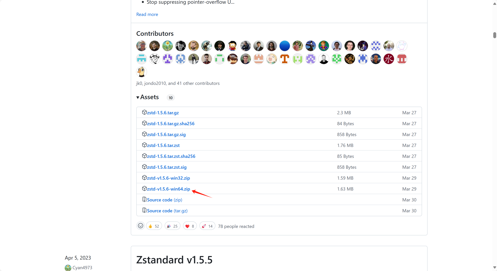

# 技术架构

做实时报表主要包括以下几个步骤：数据采集、数据处理、数据存储、数据报表。这些过程都在整个BI系统中自动执行。在数据采集主要依赖于Debezium、kafka管道，使用CDC（增量数据捕获）技术，实时将变更数据更新到目标数仓中。数仓的选型为ClickHouse,ClickHouse是一个OLAP引擎，它允许用户在不同的维度上对数据进行查询和分析，从而实现数据的多维查询和分析。在数据展现层面使用的是Superset，它是一个开源的项目，其内置丰富的图表，并能够连接到多种数据库，使各种技能的用户都能轻松探索和可视化数据。

<figure><figcaption>
BI 系统架构图
</figcaption></figure>

### Debezium

Debezium 是一套分布式服务，使用[CDC](https://debezium.io/documentation/reference/2.5/features.html)捕获数据库中的变化，以便应用程序能够看到这些变化并做出响应。Debezium 在变更事件流中记录每个数据库表中的所有行级变更，应用程序只需读取这些流，即可按变更发生的相同顺序查看变更事件。&#x20;

### Kafka Connect

Kafka Connect 是一种用于在 Apache Kafka 和其他系统之间可扩展且可靠地流式传输数据的工具。 它使快速定义将大量数据移入和移出 Kafka 的连接器变得简单。 Kafka Connect 可以摄取整个数据库或从所有应用程序服务器收集指标到 Kafka 主题中，使数据可用于低延迟的流处理。 导出作业可以将数据从 Kafka 主题传送到二级存储和查询系统或批处理系统进行离线分析。

Kafka Connect有什么优势：

* **数据中心管道** - 连接使用有意义的数据抽象来拉或推数据到Kafka。
* **灵活性和可伸缩性** - Connect可以在单个节点(独立)上与面向流和批处理的系统一起运行，也可以扩展到整个集群的服务(分布式)。
* **可重用性和可扩展性** - Connect利用现有的连接器或对其进行扩展，以适应您的需要，并缩短生产时间。

Kafka Connect专注于Kafka之间的数据流，让你可以更简单地编写高质量、可靠和高性能的连接器插件。Kafka Connect还使框架能够保证使用其他框架很难做到的事情。当与Kafka和流处理框架结合时，Kafka Connect是ETL管道的一个不可或缺的组件。

### Altinity Sink Connector

Altinity Sink Connector是一个kafka目的端的连接器，负责将数据从kafka读取到ClickHouse.

### ClickHouse

Clickhouse 是一个高性能且开源的数据库管理系统，主要用于在线分析处理 (OLAP) 业务。它采用列式存储结构，可使用 SQL 语句实时生成数据分析报告，另外它还支持索引，分布式查询以及近似计算等特性。

### Superset

Apache Superset是一个开源的、现代的、轻量级BI分析工具，能够对接多种数据源、拥有丰富的图表展示形式、支持自定义仪表盘，且拥有友好的用户界面，十分易用。

\

